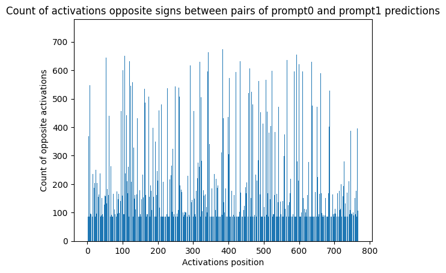

# AI-Generated Essay Detection with Prompt Generalization

This project explores how interpreting and modifying penultimate layer activations can enhance the performance of AI-generated essay detection models. Unlike traditional approaches that focus on fine-tuning across multiple prompts, this project investigates whether selective weight decay based on activation patterns can improve generalization across different prompts without the need for training on multiple datasets. The goal is to leverage insights from the model’s internal representations to make it more robust to new prompts.

## Project Overview

The project leverages a combination of human-written and AI-generated essays across two prompts to detect patterns that differentiate generated content from authentic text. The workflow includes fine-tuning a language model, observing penultimate-layer activations, and applying selective weight decay to enhance generalization across prompts.

## Dataset

The dataset is built using the **Persuade Corpus**, with the following setup:

1. **Prompts**: Two prompts, "Distance learning" and "Doestheelectoralcollegework," were selected for this study.
2. **Data Composition**:
   - **Human-Generated Texts**: 400 essays for each prompt.
   - **AI-Generated Texts**: 400 essays generated using the Mistral 7B model, based on the corresponding Persuade Corpus assignment.
3. **Train/Validation Split**: Each dataset was split into training (70%) and validation (30%) subsets.

## Methodology

1. **Training the Model**: A **Longformer model** was fine-tuned on one of the prompts' datasets, with validation performed on both prompts.
2. **Activation Analysis**: Penultimate layer activations were analyzed to identify weights that exhibit high sensitivity (frequent sign changes) between predictions for the two prompts.

3. **Selective Weight Decay**: Weight decay was applied specifically to weights showing high sensitivity, encouraging the model to focus on more general features instead of prompt-specific nuances.
4. **Retraining**: The model was retrained on the original dataset with the new weight decay strategy.

## Implementation Details

- **Custom Trainer Class**: A custom `NewTrainer` class was created by inheriting from the Hugging Face `Trainer` class. This custom class allows:
   - Extraction of hidden layer values for analyzing activations.
   - Modification of the `compute_loss` function to apply weight decay selectively to sensitive weights.
- **Evaluation Metric**: The model's performance was evaluated using the ROC AUC score.

## Results

- **Initial Score**: The model achieved a ROC AUC score of 0.9614 on the unseen prompt and 0.9780 on both prompt validation sets without selective weight decay.
- **Final Score**: After applying the selective weight decay method, the ROC AUC score improved to 0.9651 for the unseen prompt and  0.9799, demonstrating enhanced generalization across prompts.

## Conclusion

This project demonstrates a novel method for improving the generalization of AI-generated content detection by analyzing and regularizing activation patterns. By focusing on sign changes in penultimate layer activations and applying targeted weight decay, the model becomes more robust to new prompts, which is crucial in real-world AI-generated content detection.
